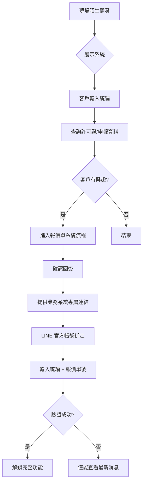
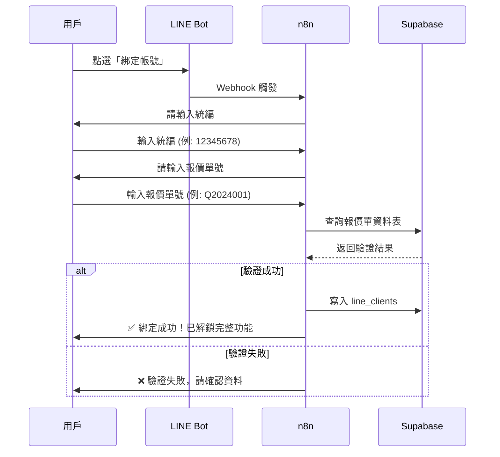
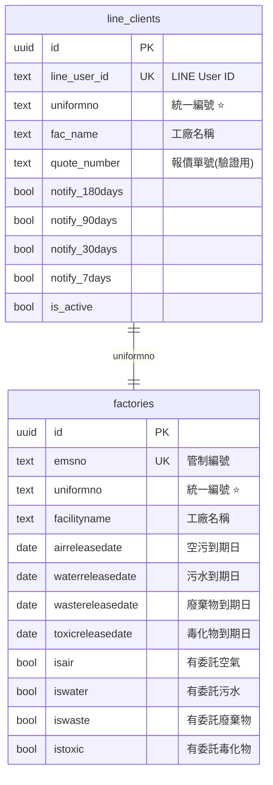

# JET 環保顧問 LINE Bot 業務系統規劃

> **版本**: v1.0  
> **更新日期**: 2025-12-17  
> **狀態**: 規劃中

---

## 一、業務流程總覽



---

## 二、LINE Bot 選單功能規劃

| 按鈕 | 功能名稱 | 動作 | 說明 | 狀態 |
|------|----------|------|------|------|
| A | 我的許可證 | `#查詢許可證` | 查看到期狀態（空氣、污水、毒化物、廢棄物） | 🔄 規劃中 |
| B | 我的報價單 | `#查詢報價單` | 歷史報價與合約 | ⏳ 待規劃 |
| C | 聯絡顧問 | `#聯絡顧問` | 有問題找這裡 | ⏳ 待規劃 |
| D | 通知設定 | `#通知設定` | 開關提醒時間 | ⏳ 待規劃 |
| E | 案件進度 | `#案件進度` | 委託案處理狀態 | ⏳ 待規劃 |
| F | 最新消息 | `#最新消息` | 法規活動公告 | ⏳ 待規劃 |

---

## 三、LINE 綁定流程

### 3.1 綁定條件
- **必要條件**: 統編 + 報價單號
- **驗證方式**: 查詢 `line_clients` 或報價單資料表核對

### 3.2 綁定流程



### 3.3 未綁定用戶權限

| 功能 | 未綁定 | 已綁定 |
|------|--------|--------|
| 最新消息 | ✅ 可用 | ✅ 可用 |
| 我的許可證 | ❌ 請先綁定 | ✅ 可用 |
| 我的報價單 | ❌ 請先綁定 | ✅ 可用 |
| 聯絡顧問 | ⚠️ 有限功能 | ✅ 可用 |
| 通知設定 | ❌ 請先綁定 | ✅ 可用 |
| 案件進度 | ❌ 請先綁定 | ✅ 可用 |

---

## 四、資料表關聯圖（正確版）



### 查詢流程
```
LINE User ID → line_clients.uniformno → factories.uniformno → 四類許可證到期日
```

---

## 五、現有資料表與查詢欄位

| 許可證類型 | 資料表 | 主要查詢欄位 | 到期日欄位 | 備註 |
|-----------|--------|-------------|-----------|------|
| 空氣 | `air_permits` | `ems_no` (管編) | `expiry_date` (民國年) | 需轉換民國年 |
| 污水 | `water_permits` | `ems_no` (管編) | `per_edate` (DATE) | 直接可用 |
| 毒化物 | `toxic_permits` | `ems_no` 或 `unino` | `edate` (DATE) | 雙欄位可查 |
| 廢棄物 | `waste_permits` | 待建立 | 待定義 | ⚠️ 尚未建立 |

> [!IMPORTANT]
> **關鍵問題**: `line_clients.uniformno`（統編）如何對應到各許可證的查詢欄位？
> - 空氣：需建立 `uniformno → ems_no` 對應表，或在 `factories` 表中維護
> - 污水/毒化物：同上，`ems_no` 是管編不是統編

---

## 六、待辦事項

- [ ] 建立 `factories` 主檔表（統編 ↔ 管編 對應）
- [ ] 建立 `waste_permits` 表
- [ ] 設計「我的許可證」n8n workflow
- [ ] 設計 LINE 綁定 n8n workflow
- [ ] 設計報價單系統流程

---

*此文件作為 JET 環保顧問系統的共用規劃文件，請隨時更新*
