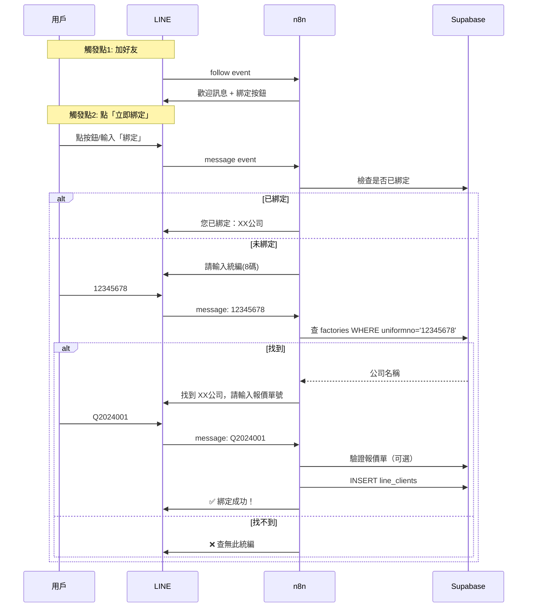

# n8n 串接設計：LINE 帳號綁定流程

> **功能**: 新用戶加好友後綁定帳號  
> **目的**: 建立 `line_user_id` ↔ `uniformno` 對應關係

---

## 一、觸發點

| 觸發方式 | Webhook Event | 說明 |
|----------|---------------|------|
| 加好友 | `follow` | 自動發送歡迎訊息 |
| 輸入「綁定」 | `message` | 手動啟動綁定 |
| 點選單未綁定 | `message` | 自動引導綁定 |

---

## 二、完整對話流程



---

## 三、n8n Workflow 設計

### Workflow 1: 加好友歡迎訊息

```
觸發: LINE Webhook (follow event)
節點:
  1. Webhook 接收
  2. 判斷 event type = follow
  3. 發送歡迎訊息 (Flex Message)
```

### Workflow 2: 綁定對話處理

```
觸發: LINE Webhook (message event)
節點:
  1. Webhook 接收
  2. 取得 userId, message.text
  3. 查詢 binding_sessions（對話狀態）
  4. Switch 節點：
     - 狀態 = null → 回「請輸入統編」
     - 狀態 = waiting_taxid → 驗證統編
     - 狀態 = waiting_quote → 驗證報價單，完成綁定
  5. 更新 binding_sessions
  6. 發送回覆
```

---

## 四、對話狀態管理

需要一個暫存表來追蹤用戶目前在綁定流程的哪個步驟：

```sql
-- binding_sessions 表（暫存對話狀態）
CREATE TABLE IF NOT EXISTS binding_sessions (
  line_user_id TEXT PRIMARY KEY,
  state TEXT,                    -- 'waiting_taxid', 'waiting_quote'
  temp_uniformno TEXT,           -- 暫存已輸入的統編
  temp_fac_name TEXT,            -- 暫存公司名稱
  created_at TIMESTAMPTZ DEFAULT NOW(),
  updated_at TIMESTAMPTZ DEFAULT NOW()
);

-- 自動過期（24小時後刪除未完成的 session）
-- 可用 Supabase Edge Function 或 n8n 定時清理
```

---

## 五、訊息範本

### 5.1 歡迎訊息（Flex Message）

```json
{
  "type": "bubble",
  "hero": {
    "type": "image",
    "url": "https://jetenv.com.tw/logo.png",
    "size": "full",
    "aspectRatio": "20:13"
  },
  "body": {
    "type": "box",
    "layout": "vertical",
    "contents": [
      {
        "type": "text",
        "text": "🎉 歡迎加入 JET 環保顧問！",
        "weight": "bold",
        "size": "lg"
      },
      {
        "type": "text",
        "text": "完成綁定後即可：\n✅ 查看許可證到期狀態\n✅ 追蹤案件進度\n✅ 接收到期提醒",
        "wrap": true,
        "margin": "md",
        "size": "sm",
        "color": "#666666"
      }
    ]
  },
  "footer": {
    "type": "box",
    "layout": "vertical",
    "contents": [
      {
        "type": "button",
        "action": {
          "type": "message",
          "label": "📋 立即綁定",
          "text": "綁定"
        },
        "style": "primary"
      },
      {
        "type": "button",
        "action": {
          "type": "message",
          "label": "❓ 稍後再說",
          "text": "稍後綁定"
        },
        "style": "link"
      }
    ]
  }
}
```

### 5.2 請輸入統編

```
📝 帳號綁定

請輸入您的公司統一編號（8碼數字）

例如：12345678
```

### 5.3 確認公司名稱

```
✅ 找到公司資料

公司名稱：XX科技有限公司
統一編號：12345678

請輸入您的報價單號進行驗證：
（格式：Q2024001）

💡 報價單號可在簽約文件上找到
```

### 5.4 綁定成功

```json
{
  "type": "bubble",
  "body": {
    "type": "box",
    "layout": "vertical",
    "contents": [
      {
        "type": "text",
        "text": "🎉 綁定成功！",
        "weight": "bold",
        "size": "xl",
        "color": "#1DB446"
      },
      {
        "type": "separator",
        "margin": "lg"
      },
      {
        "type": "box",
        "layout": "vertical",
        "margin": "lg",
        "contents": [
          {"type": "text", "text": "公司：XX科技有限公司", "size": "sm"},
          {"type": "text", "text": "統編：12345678", "size": "sm", "color": "#999999"}
        ]
      },
      {
        "type": "text",
        "text": "您現在可以使用選單查看：\n📋 我的許可證\n📊 案件進度\n🔔 通知設定",
        "wrap": true,
        "margin": "lg",
        "size": "sm"
      }
    ]
  },
  "footer": {
    "type": "box",
    "layout": "vertical",
    "contents": [
      {
        "type": "button",
        "action": {
          "type": "message",
          "label": "🔍 立即查看許可證",
          "text": "#查詢許可證"
        },
        "style": "primary"
      }
    ]
  }
}
```

### 5.5 錯誤訊息

```
❌ 查無此統編

請確認輸入的統一編號是否正確。

如有問題請聯繫：
📞 (02)6609-5888

或輸入「綁定」重新開始
```

---

## 六、驗證邏輯

### 統編驗證
```javascript
// 1. 格式檢查：8碼數字
const isValidFormat = /^\d{8}$/.test(taxId);

// 2. 查詢 factories 表
const { data } = await supabase
  .from('factories')
  .select('facilityname, uniformno')
  .eq('uniformno', taxId)
  .limit(1);

const found = data && data.length > 0;
```

### 報價單驗證（可選）
```javascript
// 如果有報價單表，可以驗證
// 暫時可以跳過，只記錄用戶輸入的報價單號
const quoteNumber = inputText.toUpperCase();
const isValidQuote = /^Q\d{7}$/.test(quoteNumber);
```

---

## 七、完成綁定 SQL

```sql
-- 寫入 line_clients
INSERT INTO line_clients (
  line_user_id,
  uniformno,
  fac_name,
  quote_number,
  is_active
) VALUES (
  'Uxxxxxxxxx',
  '12345678',
  'XX科技有限公司',
  'Q2024001',
  true
)
ON CONFLICT (line_user_id) 
DO UPDATE SET
  uniformno = EXCLUDED.uniformno,
  fac_name = EXCLUDED.fac_name,
  quote_number = EXCLUDED.quote_number,
  updated_at = NOW();

-- 清除 session
DELETE FROM binding_sessions WHERE line_user_id = 'Uxxxxxxxxx';
```

---

## 八、n8n 節點清單

| # | 節點名稱 | 類型 | 說明 |
|---|----------|------|------|
| 1 | LINE Webhook | Webhook | 接收 LINE events |
| 2 | Check Event Type | Switch | 判斷 follow/message |
| 3 | Send Welcome | HTTP Request | 發送歡迎訊息 |
| 4 | Get Session | Supabase | 查詢對話狀態 |
| 5 | Check Binding | Supabase | 查詢是否已綁定 |
| 6 | Validate TaxId | Supabase | 驗證統編 |
| 7 | Update Session | Supabase | 更新對話狀態 |
| 8 | Complete Binding | Supabase | 寫入 line_clients |
| 9 | Reply Message | HTTP Request | 回覆訊息 |

---

## 九、下一步

1. ✅ 設計完成
2. ⏳ 建立 `binding_sessions` 表
3. ⏳ 在 n8n 建立 Workflow
4. ⏳ 測試完整流程

---

*更新於 2025-12-17*
