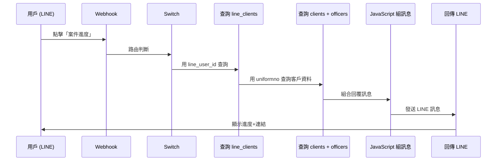

# LINE Bot「案件進度」n8n 工作流設計

## 流程圖



## 節點設計

### 1. 新增：查詢 line_clients (取得統編)

**節點名稱**: `查詢客戶綁定資料`

**類型**: Supabase - Get

```json
{
  "operation": "get",
  "tableId": "line_clients",
  "filters": {
    "conditions": [
      {
        "keyName": "line_user_id",
        "keyValue": "={{ $('Webhook').item.json.body.events[0].source.userId }}"
      }
    ]
  }
}
```

---

### 2. 新增：查詢 clients + officers (取得客戶詳細資料)

**節點名稱**: `查詢客戶進度資料`

**類型**: HTTP Request (呼叫 Supabase REST API + select join)

```json
{
  "method": "GET",
  "url": "https://yeimehdcguwnwzkmopsu.supabase.co/rest/v1/clients",
  "sendQuery": true,
  "queryParameters": {
    "parameters": [
      {
        "name": "select",
        "value": "*,officer:officers(name,phone,title)"
      },
      {
        "name": "tax_id",
        "value": "eq.{{ $json.uniformno }}"
      }
    ]
  },
  "sendHeaders": true,
  "headerParameters": {
    "parameters": [
      { "name": "apikey", "value": "YOUR_SUPABASE_ANON_KEY" },
      { "name": "Authorization", "value": "Bearer YOUR_SUPABASE_ANON_KEY" }
    ]
  }
}
```

---

### 3. 新增：JavaScript 組合訊息

**節點名稱**: `組合案件進度訊息`

**類型**: Code (JavaScript)

```javascript
const lineClient = $('查詢客戶綁定資料').first().json;
const client = $('查詢客戶進度資料').first().json;

// 處理找不到資料的情況
if (!lineClient || !lineClient.uniformno) {
  return {
    message: `❌ 查無綁定資料\n\n請先輸入統編完成綁定流程。`
  };
}

// 基本資訊
const uniformno = lineClient.uniformno;
const facName = lineClient.fac_name || client?.name || '您的公司';
const status = client?.status || '查詢中';
const nextAction = client?.next_action || '請洽承辦人';
const deadline = client?.deadline || '待確認';

// 承辦人資訊
const officerName = client?.officer?.name || '傑太團隊';
const officerPhone = client?.officer?.phone || '(02)6609-5888';

// 專屬連結
const portalUrl = `https://jetenv-sales-system.vercel.app/portal?id=${uniformno}`;

// 組合訊息
const message = `📋 案件進度查詢
━━━━━━━━━━━━

🏭 ${facName}
📊 目前狀態：${status}
📅 下一項待辦：${nextAction}
⏰ 期限：${deadline}

👇 點擊下方連結查看完整資訊：
${portalUrl}

✨ 可查看：
• 許可證到期狀態
• 專案進度
• 申報行事曆

📞 承辦人：${officerName}
☎️ ${officerPhone}`;

return { message };
```

---

### 4. 發送 LINE 訊息

**節點名稱**: `回傳案件進度`

**類型**: Line Messaging - Send

```json
{
  "operation": "send",
  "to": "={{ $('Webhook').item.json.body.events[0].source.userId }}",
  "messages": {
    "values": [
      {
        "text": "={{ $json.message }}"
      }
    ]
  }
}
```

---

## Switch 路由修改

在現有的 Switch 節點，「案件進度」output 需要連接到新的節點：

```
Switch → 案件進度 output → 查詢客戶綁定資料 → 查詢客戶進度資料 → 組合案件進度訊息 → 回傳案件進度
```

---

## 測試步驟

1. 確保有一個 LINE 用戶已綁定 (line_clients 有資料)
2. 確保該用戶的統編在 clients 表有對應資料
3. 在 LINE 發送「案件進度」
4. 確認收到包含連結的訊息
5. 點擊連結確認可開啟 ClientPortal
