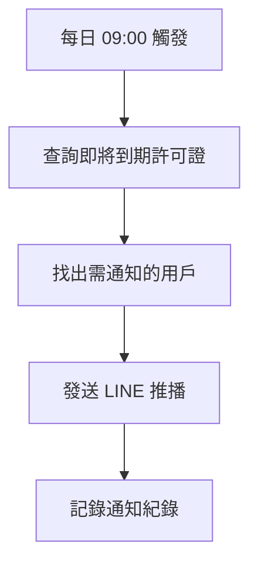

# n8n 串接設計：許可證到期通知

> **功能**: 自動發送許可證到期提醒  
> **頻率**: 每天早上 9:00 執行  
> **提醒時間**: 180 / 90 / 60 / 30 天前

---

## 一、流程總覽



---

## 二、核心 SQL 查詢

```sql
-- 查詢即將到期的許可證（並找到對應的 LINE 用戶）
SELECT 
  lc.line_user_id,
  lc.fac_name,
  f.uniformno,
  f.facilityname,
  
  -- 空污
  f.airreleasedate,
  CASE WHEN f.airreleasedate IS NOT NULL 
       THEN (f.airreleasedate - CURRENT_DATE) 
  END AS air_days_left,
  
  -- 水污
  f.waterreleasedate,
  CASE WHEN f.waterreleasedate IS NOT NULL 
       THEN (f.waterreleasedate - CURRENT_DATE) 
  END AS water_days_left,
  
  -- 廢棄物
  f.wastereleasedate,
  CASE WHEN f.wastereleasedate IS NOT NULL 
       THEN (f.wastereleasedate - CURRENT_DATE) 
  END AS waste_days_left,
  
  -- 毒化物
  f.toxicreleasedate,
  CASE WHEN f.toxicreleasedate IS NOT NULL 
       THEN (f.toxicreleasedate - CURRENT_DATE) 
  END AS toxic_days_left

FROM line_clients lc
JOIN factories f ON lc.uniformno = f.uniformno
WHERE lc.is_active = true
  AND (
    -- 180 天前
    (f.airreleasedate - CURRENT_DATE) = 180 OR
    (f.waterreleasedate - CURRENT_DATE) = 180 OR
    (f.wastereleasedate - CURRENT_DATE) = 180 OR
    (f.toxicreleasedate - CURRENT_DATE) = 180 OR
    
    -- 90 天前
    (f.airreleasedate - CURRENT_DATE) = 90 OR
    (f.waterreleasedate - CURRENT_DATE) = 90 OR
    (f.wastereleasedate - CURRENT_DATE) = 90 OR
    (f.toxicreleasedate - CURRENT_DATE) = 90 OR
    
    -- 60 天前
    (f.airreleasedate - CURRENT_DATE) = 60 OR
    (f.waterreleasedate - CURRENT_DATE) = 60 OR
    (f.wastereleasedate - CURRENT_DATE) = 60 OR
    (f.toxicreleasedate - CURRENT_DATE) = 60 OR
    
    -- 30 天前
    (f.airreleasedate - CURRENT_DATE) = 30 OR
    (f.waterreleasedate - CURRENT_DATE) = 30 OR
    (f.wastereleasedate - CURRENT_DATE) = 30 OR
    (f.toxicreleasedate - CURRENT_DATE) = 30
  );
```

---

## 三、n8n Workflow 設計

### 節點配置

| # | 節點 | 類型 | 說明 |
|---|------|------|------|
| 1 | Schedule Trigger | Cron | 每天 09:00 觸發 |
| 2 | Query Supabase | Supabase | 執行上述 SQL |
| 3 | Loop Each User | SplitInBatches | 逐一處理 |
| 4 | Format Message | Code | 產生通知訊息 |
| 5 | Send LINE Push | HTTP Request | 推播訊息 |

---

## 四、訊息模板

### 4.1 單一許可證到期

```
⚠️ 許可證到期提醒

📋 XX科技有限公司

🌬️ 空污許可證將於 30 天後到期
📅 到期日：2025-01-17

請儘早辦理展延！

[📞 聯繫顧問]
```

### 4.2 多個許可證到期（Flex Message）

```json
{
  "type": "bubble",
  "header": {
    "type": "box",
    "layout": "vertical",
    "backgroundColor": "#FF6B6B",
    "contents": [{
      "type": "text",
      "text": "⚠️ 許可證到期提醒",
      "color": "#ffffff",
      "weight": "bold",
      "size": "lg"
    }]
  },
  "body": {
    "type": "box",
    "layout": "vertical",
    "contents": [
      {
        "type": "text",
        "text": "XX科技有限公司",
        "weight": "bold",
        "size": "md"
      },
      {"type": "separator", "margin": "md"},
      {
        "type": "box",
        "layout": "horizontal",
        "margin": "md",
        "contents": [
          {"type": "text", "text": "🌬️ 空污許可", "flex": 3, "size": "sm"},
          {"type": "text", "text": "30天後到期", "flex": 2, "size": "sm", "color": "#FF0000", "align": "end"}
        ]
      },
      {
        "type": "box",
        "layout": "horizontal",
        "contents": [
          {"type": "text", "text": "💧 水污許可", "flex": 3, "size": "sm"},
          {"type": "text", "text": "90天後到期", "flex": 2, "size": "sm", "color": "#FFAA00", "align": "end"}
        ]
      }
    ]
  },
  "footer": {
    "type": "box",
    "layout": "vertical",
    "contents": [{
      "type": "button",
      "action": {
        "type": "uri",
        "label": "📞 聯繫顧問",
        "uri": "tel:0266095888"
      },
      "style": "primary",
      "color": "#FF6B6B"
    }]
  }
}
```

---

## 五、n8n Code 節點（格式化訊息）

```javascript
const items = $input.all();
const results = [];

for (const item of items) {
  const data = item.json;
  const alerts = [];
  
  // 檢查各許可證
  if ([180, 90, 60, 30].includes(data.air_days_left)) {
    alerts.push({ type: '🌬️ 空污', days: data.air_days_left, date: data.airreleasedate });
  }
  if ([180, 90, 60, 30].includes(data.water_days_left)) {
    alerts.push({ type: '💧 水污', days: data.water_days_left, date: data.waterreleasedate });
  }
  if ([180, 90, 60, 30].includes(data.waste_days_left)) {
    alerts.push({ type: '🗑️ 廢棄物', days: data.waste_days_left, date: data.wastereleasedate });
  }
  if ([180, 90, 60, 30].includes(data.toxic_days_left)) {
    alerts.push({ type: '☠️ 毒化物', days: data.toxic_days_left, date: data.toxicreleasedate });
  }
  
  if (alerts.length > 0) {
    // 產生文字訊息
    let message = `⚠️ 許可證到期提醒\n\n📋 ${data.fac_name}\n\n`;
    for (const alert of alerts) {
      message += `${alert.type}：${alert.days} 天後到期\n`;
    }
    message += `\n請儘早辦理展延！`;
    
    results.push({
      json: {
        line_user_id: data.line_user_id,
        message: message
      }
    });
  }
}

return results;
```

---

## 六、LINE Push API 呼叫

```
POST https://api.line.me/v2/bot/message/push

Headers:
  Authorization: Bearer {{LINE_CHANNEL_ACCESS_TOKEN}}
  Content-Type: application/json

Body:
{
  "to": "{{line_user_id}}",
  "messages": [{
    "type": "text",
    "text": "{{message}}"
  }]
}
```

---

## 七、n8n Workflow JSON（可匯入）

```json
{
  "name": "LINE 許可證到期通知",
  "nodes": [
    {
      "name": "Schedule Trigger",
      "type": "n8n-nodes-base.scheduleTrigger",
      "position": [250, 300],
      "parameters": {
        "rule": {
          "interval": [{"field": "cronExpression", "expression": "0 9 * * *"}]
        }
      }
    },
    {
      "name": "Query Expiring Permits",
      "type": "n8n-nodes-base.supabase",
      "position": [450, 300],
      "parameters": {
        "operation": "executeQuery",
        "query": "-- 見上方 SQL"
      }
    },
    {
      "name": "Format Messages",
      "type": "n8n-nodes-base.code",
      "position": [650, 300],
      "parameters": {
        "jsCode": "// 見上方 Code"
      }
    },
    {
      "name": "Send LINE Push",
      "type": "n8n-nodes-base.httpRequest",
      "position": [850, 300],
      "parameters": {
        "method": "POST",
        "url": "https://api.line.me/v2/bot/message/push",
        "headers": {
          "Authorization": "Bearer {{$env.LINE_CHANNEL_ACCESS_TOKEN}}"
        },
        "body": {
          "to": "={{$json.line_user_id}}",
          "messages": [{"type": "text", "text": "={{$json.message}}"}]
        }
      }
    }
  ],
  "connections": {
    "Schedule Trigger": {"main": [[{"node": "Query Expiring Permits"}]]},
    "Query Expiring Permits": {"main": [[{"node": "Format Messages"}]]},
    "Format Messages": {"main": [[{"node": "Send LINE Push"}]]}
  }
}
```

---

## 八、快速開始步驟

1. ✅ 確認 `line_clients` 和 `factories` 表已有資料
2. ⏳ 在 n8n 匯入 Workflow
3. ⏳ 設定 LINE_CHANNEL_ACCESS_TOKEN 環境變數
4. ⏳ 測試：手動觸發一次
5. ⏳ 啟用定時執行

---

*更新於 2025-12-17*
